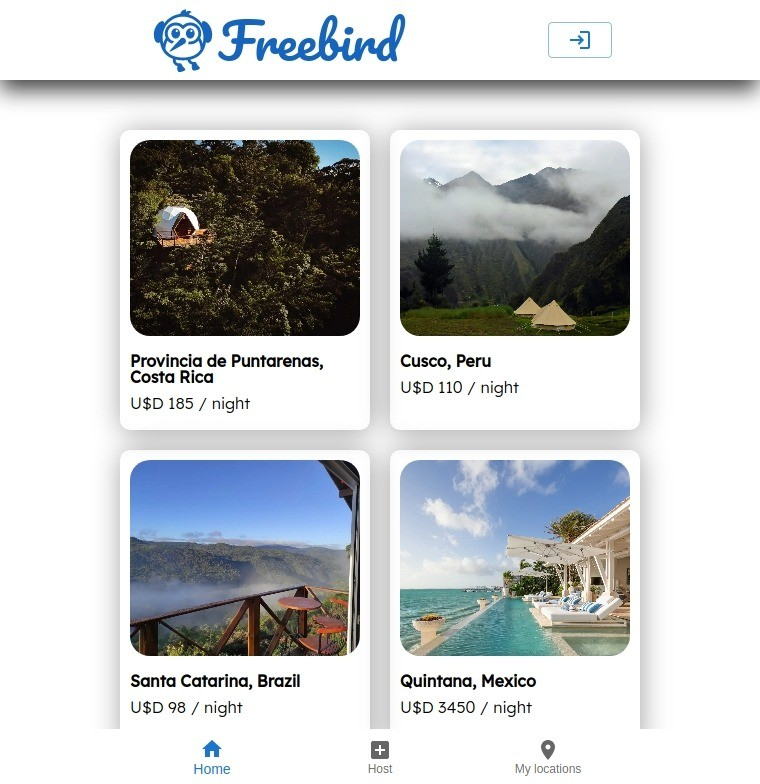
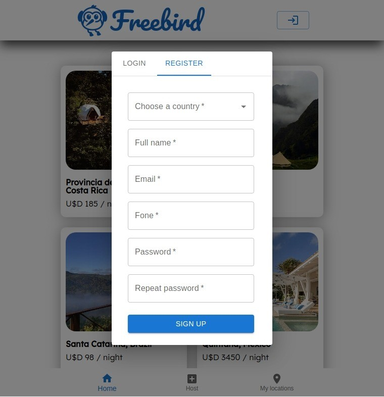
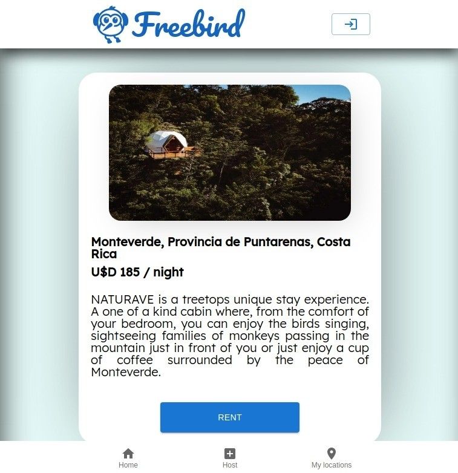
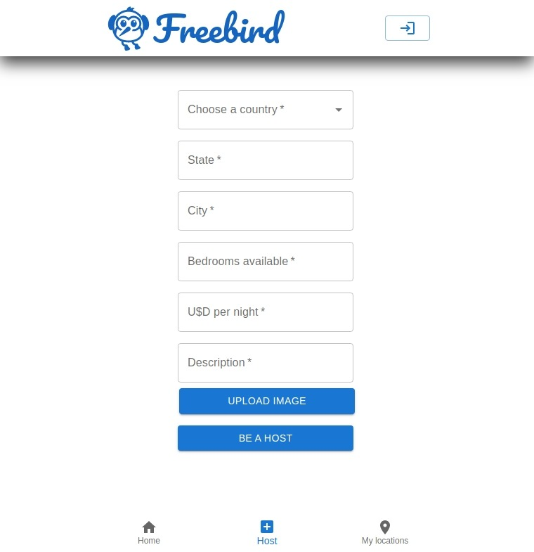
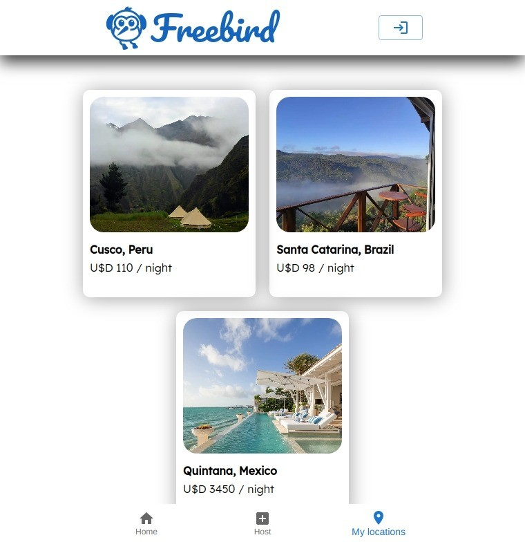

# <p align = "center"> Freebird </p>

#### <p align = "center" style="color:red" > Confira também o [front-end](https://github.com/gabrzeoN/freebird-front) </p>
##
<div align = "center" >
    
    
    
    
    
</div>

***

##  :clipboard: Descrição

Freebird é um serviço online comunitário para as pessoas anunciarem, descobrirem e reservarem acomodações e meios de hospedagem.

***

## :computer:	 Tecnologias e Conceitos 

- React
- MUI
- styled-components
- Node.js
- Postgresql com Prisma
- Supabase
- Arquitetura em camadas
- Axios
- joi
- bcrypt

***

## 🏁 Rodando o back-end

1. Primeiro, faça o clone desse repositório na sua maquina:
```
    git clone https://github.com/gabrzeoN/freebird-back.git
    ou
    git clone git@github.com:gabrzeoN/freebird-back.git
```

2. Depois, dentro da pasta, rode o seguinte comando para instalar as dependências
```
    npm install
```

3. Configure o arquivo **.env** com base no arquivo **.env.example**

4. Gere um banco de dados postgres e adicione as seeds com o prisma
```
  npx prisma migrate dev
```

5. Finalizado o processo, é só inicializar o servidor
```
npm run dev
```
